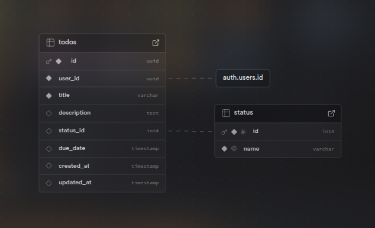
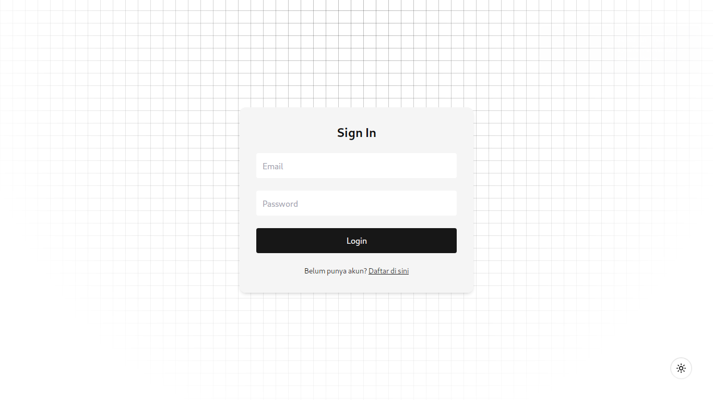
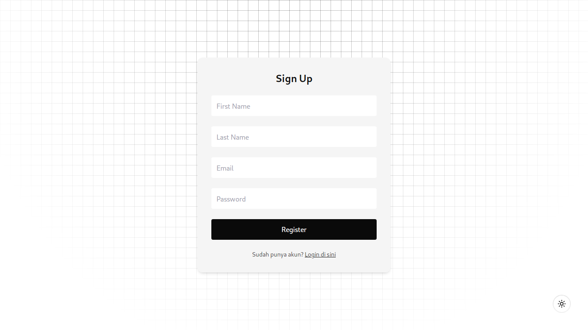
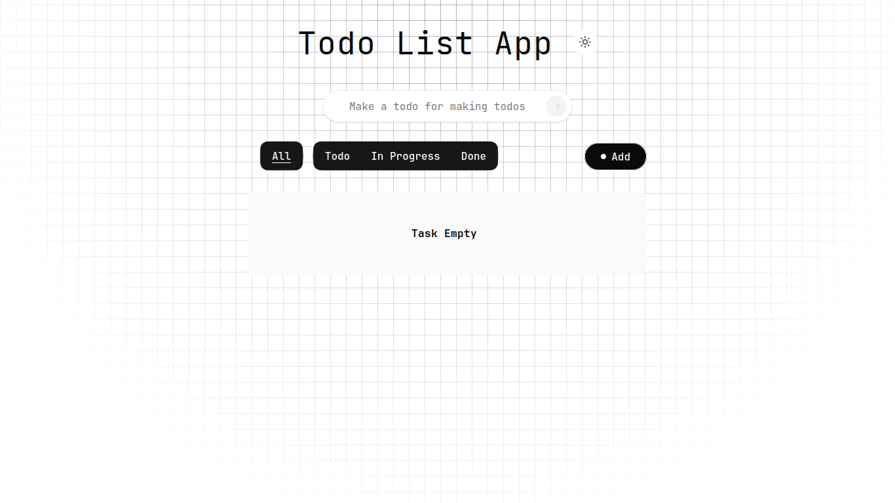

<a id="readme-top"></a>
<br />

<div align="center">
<h1 align="center">Todo List Desktop</h1>

  <p align="center">
    Project For Portfolio
    <br />
    <br />
    <a href="https://simple-journey-challenge.vercel.app" target="_blank" rel="noopener noreferrer" >
    
  </a>
  <a href="https://github.com/sidoelz123/simple-journey-challenge/issues/new?labels=bug&template=bug-report---.md">
    
  </a>
  <a href="https://github.com/sidoelz123/simple-journey-challenge/issues/new?labels=enhancement&template=feature-request---.md">
    
  </a>
  </p>
</div>

<!-- ABOUT THE PROJECT -->


## 🛠 Tech Stack

[![Wails][Wails]][Wails-url] [![Vue][Vue.js]][Vue-url] [![typescript][typescript]][typescript-url] [![tailwind][tailwindcss.com]][tailwind-url]

<p align="right">(<a href="#readme-top">back to top</a>)</p>


## Database Schema



## Layout Design






<p align="right">(<a href="#readme-top">back to top</a>)</p>

<!-- GETTING STARTED -->

## 📁 Getting Started

### Installation

1. Clone the repo
   ```sh
   https://github.com/sidoelz123/wails-Todolist.git
   ```
2. Navigate to the Project Directory

    ```sh
    cd wails-Todolist
    ```

3. Install Depedencies
   ```sh
   go mod tidy
   ```

4. Start the project
   ```sh
   wails dev
   ```

<p align="right">(<a href="#readme-top">back to top</a>)</p>

<!-- MARKDOWN LINKS & IMAGES -->
<!-- https://www.markdownguide.org/basic-syntax/#reference-style-links -->

[contributors-shield]: https://img.shields.io/github/contributors/sidoelz123/MedpointSystemCMS.svg?style=for-the-badge
[contributors-url]: https://github.com/sidoelz123/MedpointSystemCMS/graphs/contributors
[forks-shield]: https://img.shields.io/github/forks/sidoelz123/MedpointSystemCMS.svg?style=for-the-badge
[forks-url]: https://github.com/sidoelz123/MedpointSystemCMS/network/members
[stars-shield]: https://img.shields.io/github/stars/sidoelz123/MedpointSystemCMS.svg?style=for-the-badge
[stars-url]: https://github.com/sidoelz123/MedpointSystemCMS/stargazers
[issues-shield]: https://img.shields.io/github/issues/sidoelz123/MedpointSystemCMS.svg?style=for-the-badge
[issues-url]: https://github.com/sidoelz123/MedpointSystemCMS/issues
[license-shield]: https://img.shields.io/github/license/sidoelz123/MedpointSystemCMS.svg?style=for-the-badge
[license-url]: https://github.com/sidoelz123/MedpointSystemCMS/blob/master/LICENSE.txt
[linkedin-shield]: https://img.shields.io/badge/-LinkedIn-black.svg?style=for-the-badge&logo=linkedin&colorB=555
[linkedin-url]: https://linkedin.com/in/ihzamz
[product-screenshot]: images/screenshot.png
[typescript]: https://img.shields.io/badge/TypeScript-20232A?style=for-the-badge&logo=typescript
[typescript-url]: https://www.typescriptlang.org/
[Vue.js]: https://img.shields.io/badge/Vue.js-20232A?style=for-the-badge&logo=vuedotjs
[Vue-url]: https://vuejs.org/
[Tailwindcss.com]: https://img.shields.io/badge/Tailwind_CSS-20232A?style=for-the-badge&logo=tailwind-css
[Tailwind-url]: https://tailwindcss.com
[Wails]: https://img.shields.io/badge/Wails-20232A?style=for-the-badge&logo=wails&logoColor=DF0000
[Wails-url]: https://wails.io